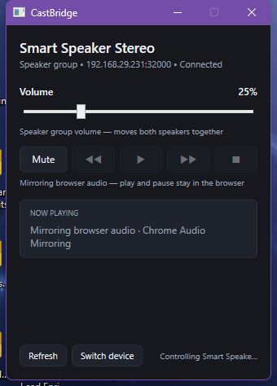
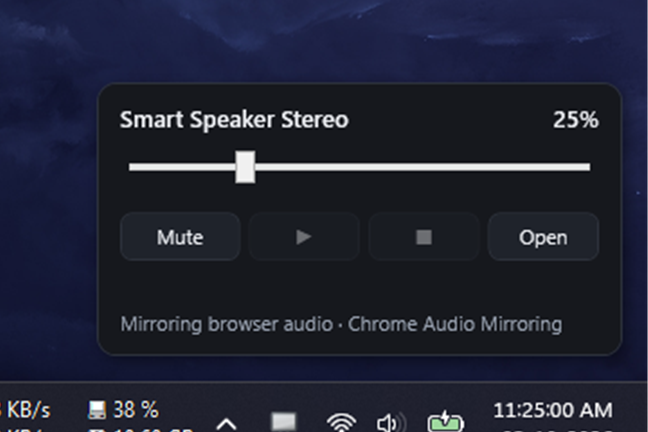
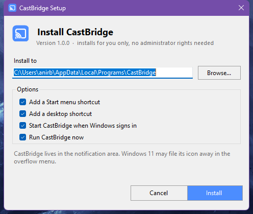
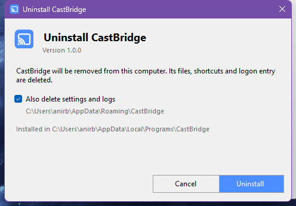

# CastBridge

A Windows tray app for controlling a Cast **speaker group**: volume, mute and playback, with the
state read from the speaker itself.

It exists to fill one specific gap: Chromium can cast music to a speaker group, but it has no UI for
changing that group's volume. CastBridge does that, and stays out of the way of everything else.



Clicking the tray icon opens a compact popup, the way the system's own flyouts work. It stays until
you click anywhere outside it, and double-clicking the icon goes straight to the full window:



## What it does

* **Volume, the reason it exists.** The slider reads the group's real level on connect and follows it
  while the app runs, so a change made anywhere else shows up here too.
* **Mute** on the group or on an individual speaker.
* **Now Playing, straight from the device** — title, artist, album, artwork, player state, elapsed
  time and a progress bar, all taken from the media status the receiver publishes.
* **Play / pause / next / previous / stop** when the speaker is running a real media session.
* **Prefers the group** over individual members, because the group is what moves both speakers.
* Closing *or minimizing* the window hides it to the tray; only the tray's Quit really exits.
* **Starts with Windows** out of the box: it registers itself on the first run, and *Start with
  Windows* in the tray menu turns that off for good.

## What it deliberately does not do

**It serves no media and binds no port.** Everything here is volume, mute and transport over the
local Cast protocol, none of which needs an HTTP server, and the app holds zero listening sockets.

Casting stays where you already do it — in Chromium. That split is deliberate: it keeps CastBridge
out of the way of whatever else is serving media, it means there is nothing to add to the Windows
firewall, and it removes the whole class of "the speaker cannot reach my PC" failures.

If you want to explore the media side, `CastBridge.Cli` still has the full pipeline and can start a
server on demand. The desktop app never does.

## Read this before wondering why play/pause is greyed out

Chromium casts in two quite different ways, and only one of them can be controlled from here:

| What you did in Chromium | What the speaker runs | Volume / mute | Play, pause, stop |
|---|---|---|---|
| **Cast tab / Cast screen** (audio mirroring) | "Chrome Audio Mirroring" | works | **not possible** — the speaker receives an audio stream, not a media session. The browser owns playback. |
| **A site's cast button** (YouTube, a web player) | that site's receiver, or the Default Media Receiver | works | works — the commands go to the media session with the id the speaker reports |

The app detects the mirroring case and says so instead of offering buttons that cannot do anything:
the transport row is disabled and captioned *"Mirroring browser audio — play and pause stay in the
browser"*. It redirects the *Media namespace* messages to a session that the receiver owns, so
whatever started the cast — this app, the Google Home app, or the browser — keeps owning it.

## Installing it

For anyone else, there is a setup file: **`CastBridge-1.0.0-Setup.exe`**. Copy that one file to
another Windows machine and double click it.

It is published as an asset on the repository's **Releases** page rather than committed here — a
90 MB binary does not belong in a git history. The release notes, including the file's SHA256, are
in [CHANGELOG.md](CHANGELOG.md). To build it yourself, run:

```powershell
powershell -ExecutionPolicy Bypass -File tools\build-installer.ps1
```

which leaves it in `dist\`. The **Actions** tab builds it on every push, and the workflow run lets
you download it without building anything locally.



It installs for the person running it, into `%LOCALAPPDATA%\Programs\CastBridge`, and needs **no
administrator rights** and **nothing preinstalled** — the .NET runtime travels inside the same file,
the same self-contained executable you can run directly. There is no separate installer to download,
no runtime to put in the prerequisites list, and nothing to install before it.

What it does:

* puts `CastBridge.exe` and a small uninstaller in the folder above,
* adds Start menu shortcuts for CastBridge and for *Uninstall CastBridge*, and a desktop shortcut,
* registers CastBridge to start when Windows signs in, the same thing the app does for itself on
  its first run — untick it in the window and the app will not put it back,
* adds **CastBridge** to *Settings → Apps → Installed apps*, with a working **Uninstall** button,
* optionally starts CastBridge straight away, so you can see the tray icon immediately.

Uninstalling — from that Apps list, from the Start menu shortcut, or by running
`CastBridge.exe`'s folder's `CastBridge-Uninstall.exe` — closes the app, deletes the files, the
shortcuts, the logon entry and the Add/Remove entry, and asks whether to delete CastBridge's
settings and logs too. Nothing of yours is touched if you answer no.



Silent and scripted installs work as well, which is what you want on a few machines at once:

```powershell
CastBridge-1.0.0-Setup.exe /S                                  # defaults, no window
CastBridge-1.0.0-Setup.exe /S /D="D:\Apps\CastBridge"           # somewhere else
CastBridge-1.0.0-Setup.exe /S /no-startup /no-desktop /no-launch
CastBridge-1.0.0-Setup.exe /uninstall /S                        # remove it again
```

Exit codes are 0 for success, 1 for failure, and 2 when an uninstall prompt is declined. Anything
the installer does is recorded in `%APPDATA%\CastBridge\installer.log`.

To rebuild the setup file after changing anything:

```powershell
powershell -ExecutionPolicy Bypass -File tools\build-installer.ps1
```

It republishes `CastBridge.exe`, builds the uninstaller, and embeds both into the setup executable.
`tools\verify-install.ps1` then installs and removes it in a scratch folder under `%TEMP%` and
checks every file, shortcut and registry entry against what it should have produced.

## Repository layout

| Path | What it is |
|---|---|
| `src/CastBridge.App` | the WPF tray app: the window, the tray icon, the start-up registration |
| `src/CastBridge.Core` | the Cast protocol: discovery, the cast channel, device state |
| `src/CastBridge.Media` | the media pipeline, used by the CLI and deliberately not by the app |
| `tools/CastBridge.Cli` | terminal front end over the same services |
| `tools/CastBridge.Installer` | the setup executable: embeds the app and the uninstaller |
| `tools/CastBridge.Uninstaller` | the uninstaller stub the installer drops next to the app |
| `tools/*.ps1` | publish, build the installer, and the diagnostics used while developing |
| `tests/` | xunit tests for the parts that can be tested without a speaker on the network |

The two installer projects are deliberately **not** in `CastBridge.slnx`: they embed the published
`dist\CastBridge.exe`, so building them needs `tools\publish.ps1` to have run first.
`tools\build-installer.ps1` does that, then builds them.

## Running it without installing

Double-click `dist\CastBridge.exe` or the `CastBridge` shortcut on your Desktop. It runs from
anywhere and needs no install at all. To rebuild just that file:

```powershell
powershell -ExecutionPolicy Bypass -File tools\publish.ps1
```

### Finding the icon

Windows 11 files a newly seen tray icon into the **overflow flyout** — the `^` arrow next to the
clock — until you tell it otherwise. The first time CastBridge runs it shows a notification saying
so. To keep the icon visible from then on: click `^`, then drag the CastBridge icon down onto the
taskbar (or right-click it and choose *Pin to taskbar* / open *Taskbar settings* and set it to
always show).

If the icon is missing entirely, the log at `%APPDATA%\CastBridge\app.log` records whether the icon
was created and loaded (`tray icon: source=loaded created=True`), and any failure while showing the
tray popup. A background app has nowhere to print a stack trace, so everything it survives - and
everything it does not - is written there.

Troubleshooting helpers, both read-only:

```powershell
tools\check-crash-log.ps1        # did Windows record a crash for CastBridge?
tools\check-event-window.ps1 -At '2026-10-03 12:21:00' -Seconds 90   # what was logged around then
```

Useful flags:

```powershell
CastBridge.exe --tray-popup   # show the tray popup immediately (diagnostic)
```

For the terminal front end over the same services:

```bash
dotnet run --project tools/CastBridge.Cli -- devices                  # list speakers
dotnet run --project tools/CastBridge.Cli -- status "Smart Speaker Stereo"
dotnet run --project tools/CastBridge.Cli -- volume "Smart Speaker Stereo" 40
dotnet run --project tools/CastBridge.Cli -- transport "Smart Speaker Stereo" play
dotnet run --project tools/CastBridge.Cli -- watch "Smart Speaker Stereo" 20
dotnet test                                                          # 66 tests
```

`status` prints the running receiver app (`runningAppId`, `mirroring`), which is the fastest way to
see which of the two cast modes above you are in. `watch` follows volume and now playing exactly the
way the app does.

## How it keeps up

The cast this app controls was started by somebody else, so it cannot wait for its own commands to
learn anything. On startup — and whenever you switch devices — it connects to the selected speaker,
reads its volume and media session, and then polls both every couple of seconds. Media status
messages the speaker pushes are applied as they arrive.

That is also why the volume slider no longer sits at zero until you touch it.

## Projects

| Project | What it is |
|---|---|
| `src/CastBridge.Core` | Cast protocol: discovery, device state, volume, transport, groups |
| `src/CastBridge.Media` | Media server, byte ranges, library, transcode, live capture (opt-in) |
| `src/CastBridge.App` | The tray app |
| `tools/CastBridge.Cli` | Terminal front end over the same services |
| `tests/CastBridge.Tests` | xUnit tests |

## Notes on the protocol

Volume writes are coalesced: a slider drag sets the value locally and one write goes out to the
speaker, instead of two hundred. A volume the *device* reports is never written back, so polling
cannot fight a drag.

A stereo pair appears as three devices: two members plus the group. The group is preferred on
startup, and it is the one whose volume moves both speakers together.

Nothing here touches Google's cloud, so it keeps working on hardware Google no longer supports —
which is why these speakers still answer it.
